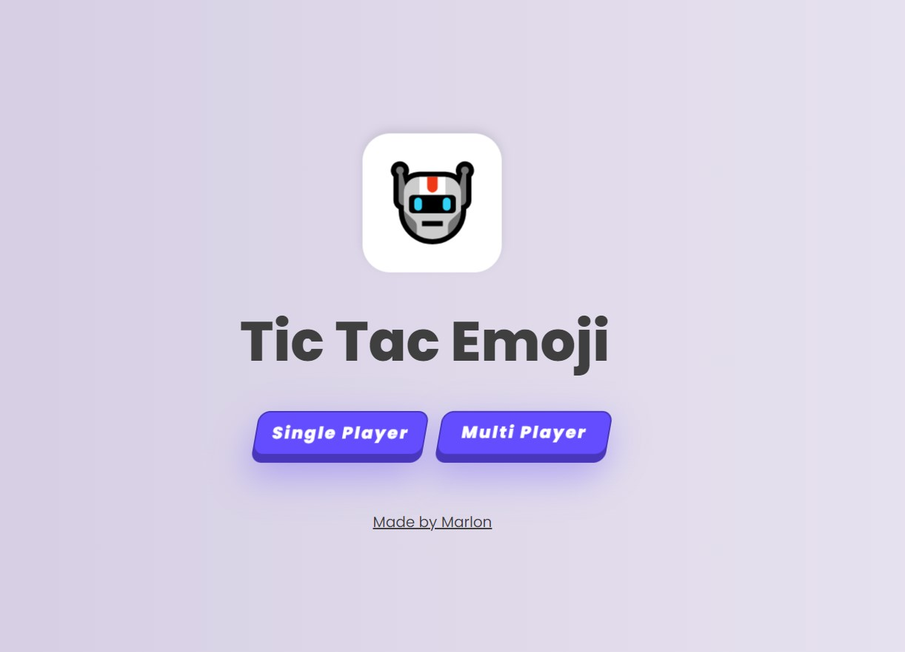
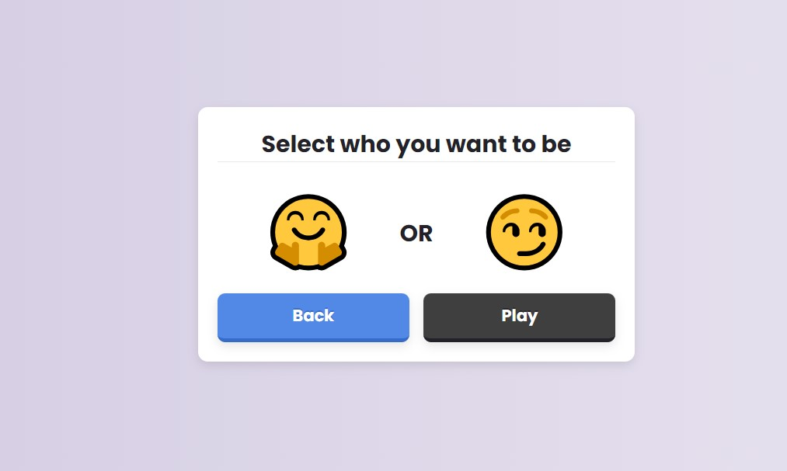
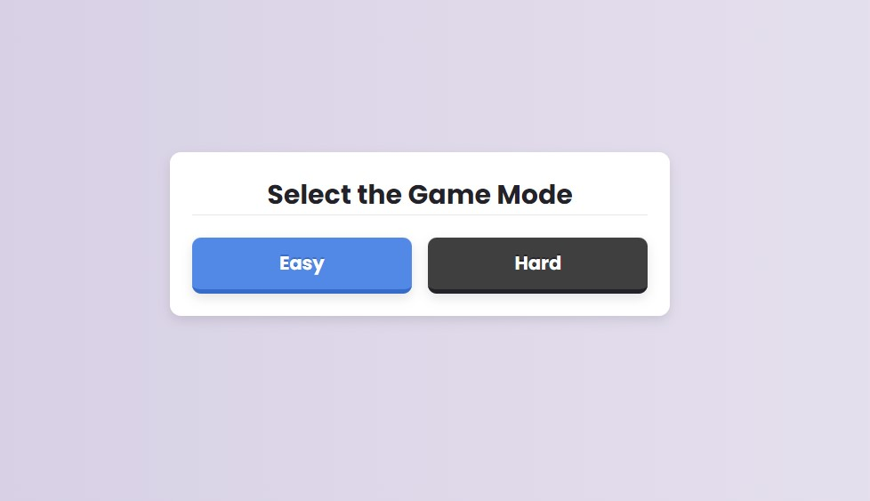
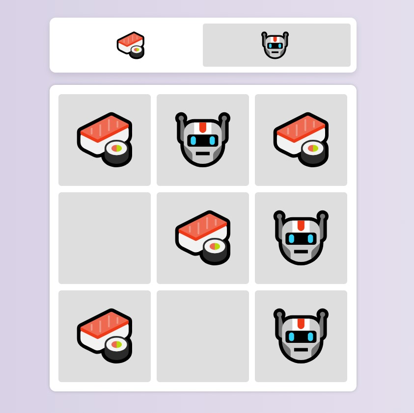
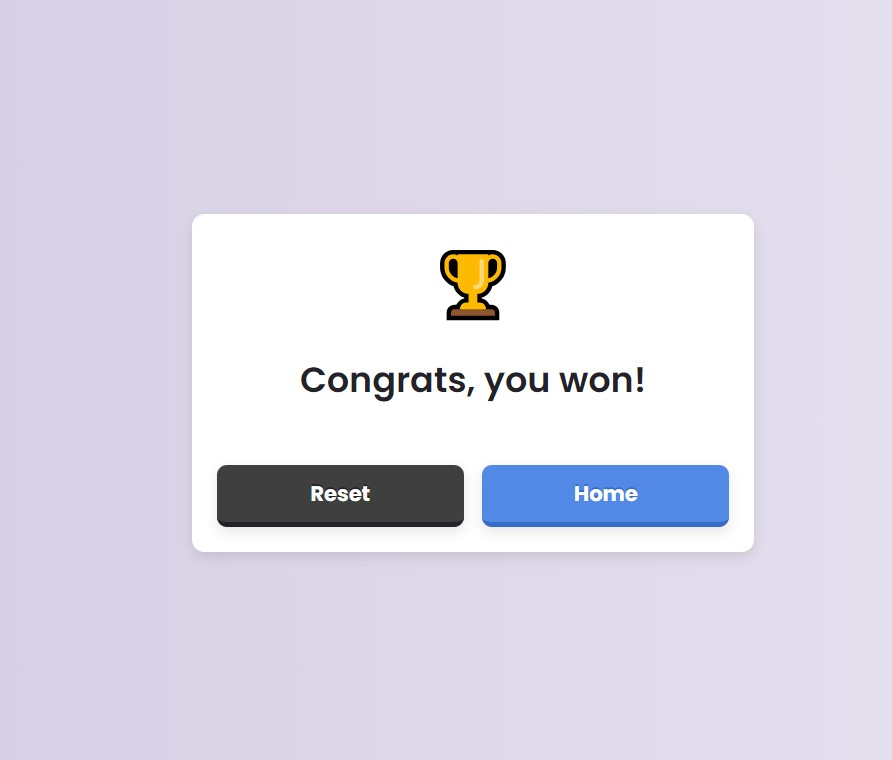

# 😛 TIC TAC TOE EMOJI

¡Bienvenido a TIC TACT TOE EMOJI, el juego de tres en línea basado en emojis!

## Descripción

TIC TACT TOE EMOJI es un juego de tic-tac-toe que ofrece modos de juego emocionantes, tanto para un solo jugador como para varios jugadores. Cada vez que juegas, te encuentras con nuevos emojis que le dan un toque único a la experiencia.

## Modos de Juego

### 1️⃣ Modo para un Solo Jugador

En este modo, te enfrentarás contra un bot de la computadora.

- **Cómo jugar:**

  - Haz clic en el botón 'Jugador Solo' para jugar.
  - Elige un jugador: siempre aparecen nuevos emojis cada vez que visitas la página de selección de jugador.
  - Luego, elige el modo de juego con el que quieres enfrentarte al bot: Difícil o Fácil.
  - El jugador que consiga 3 en línea primero gana.

- **Final del juego:**

  - Ya sea una victoria, una derrota o un empate, aparecerá un modal mostrando el resultado una vez que el juego termine. Luego verás dos botones:
    - Botón 'Repetir' para jugar de nuevo.
    - Botón 'Inicio' para regresar al menú principal.

- **Continuar juego:**
  - Si cierras el navegador o dejas la página y vuelves, reanudarás el juego desde donde lo dejaste.

### 2️⃣ Modo Multijugador

En este modo, puedes jugar con otra persona que esté sentada a tu lado.

- **Cómo jugar:**

  - El primer jugador es seleccionado automáticamente, y el segundo jugador automáticamente recibe su propio emoji (aleatorio en cada ronda de juego).
  - El jugador que consiga 3 en línea primero gana.

- **Final del juego:**

  - Ya sea una victoria, una derrota o un empate, aparecerá un modal mostrando el resultado una vez que el juego termine. Luego verás dos botones:
    - Botón 'Repetir' para jugar de nuevo.
    - Botón 'Inicio' para regresar al menú principal.

- **Continuar juego:**
  - Si cierras el navegador o dejas la página y vuelves, reanudarás el juego desde donde lo dejaste.

## Tecnologías ⚡

- [Vite](https://vitejs.dev/)
- [React.js](https://reactjs.org/)
- [TypeScript](https://www.typescriptlang.org/)
- [Zustand](https://zustand.surge.sh/)
- [Styled Components](https://styled-components.com/)
- [Framer Motion](https://www.framer.com/motion/)

## Capturas de Pantalla

### Pantalla Principal

### Selección de Jugador

### Selección de Dificultad

### En Juego

### Felicidades

